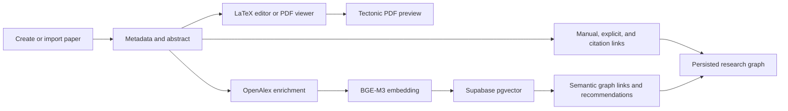
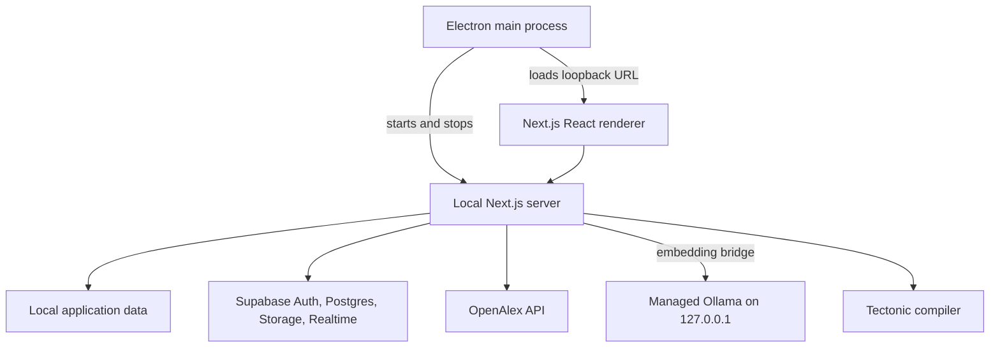

# PaperGraph

<div align="center">


**A Windows desktop workspace for writing, organising, and exploring scientific literature.**

[Download releases](https://github.com/Hug00x/PaperGraph/releases) · [Report an issue](https://github.com/Hug00x/PaperGraph/issues)

</div>

PaperGraph brings LaTeX writing, PDF-based paper collection, and a visual research graph into one workspace. Papers can be drafted, submitted for review, connected through explicit links or citations, and enriched with OpenAlex metadata. A local BGE-M3 embedding pipeline can also identify semantic relationships and rerank related-paper recommendations.

The repository currently targets a Windows x64 desktop application. A Next.js development server is also available for working on the web UI and server routes.

## Contents

- [Features](#features)
- [How It Works](#how-it-works)
- [Architecture](#architecture)
- [Local Semantic Processing](#local-semantic-processing)
- [External Services and Data](#external-services-and-data)
- [Installation](#installation)
- [Development](#development)
- [Building](#building)
- [Project Structure](#project-structure)
- [Configuration](#configuration)
- [Limitations](#limitations)
- [Contributing and License](#contributing-and-license)

## Features

### Writing and PDFs

- CodeMirror-based LaTeX editor with syntax highlighting.
- Draft autosave, review and published states, version history, and restoration.
- Local LaTeX compilation with Tectonic and an in-app PDF preview with zoom controls.
- Image and PDF assets associated with an article, including LaTeX insertion helpers.
- Multiple-PDF import with sequential processing, duplicate detection, per-file progress, and retryable failures.
- Local extraction of title, DOI, and abstract from the first three pages of text-layer PDFs.

### Research graph

- Articles are graph nodes with persisted positions.
- Manual and explicit relations, including `[[Article]]` and `[[Article|visible text]]` links.
- Citation relations from OpenAlex metadata.
- Semantic relations based on stored vector similarity.
- Unlinked-mention detection and relation-type filtering.
- Recommendations can be added to a workspace as published articles.

### Workspaces and collaboration

- Email/password authentication through Supabase Auth.
- Multiple workspaces, invitations, membership roles, ownership transfer, and workspace deletion.
- Viewer and editor permissions enforced by Supabase policies.
- Atomic workspace snapshots with revision checks to prevent stale clients from overwriting newer data.
- Supabase Realtime presence for current workspace activity and Yjs-based collaborative LaTeX state with remote cursors.
- Local UI state remembers the active workspace, tab, and selected article.

## How It Works

The main workflow connects the writing surface to the graph without treating an imported PDF as editable LaTeX source:



Imported PDFs are stored as article assets and can be viewed in the application. Their text layer may supply metadata for academic processing, but the PDF itself is not converted into an editable LaTeX project.

## Architecture

PaperGraph uses Electron as its Windows shell around a standalone Next.js application. In development, `npm run desktop:dev` starts the local Next server and opens Electron. In a packaged build, Electron starts the standalone server on a loopback address, loads it in a sandboxed `BrowserWindow`, and provides the managed embedding runtime separately.



The Electron window uses context isolation, sandboxing, and disabled Node integration. The preload exposes only semantic-runtime state, retry, and subscription methods. The packaged server receives public Supabase configuration, while private server keys are removed from the Electron-launched environment.

## Local Semantic Processing

The packaged Windows application includes a pinned Ollama 0.34.3 Windows x64 runtime, but not the model weights. PaperGraph starts this runtime itself, on loopback, with a private model directory and `OLLAMA_NO_CLOUD=1`. It does not use an Ollama installation found on `PATH`, and it does not modify the user's normal `.ollama` directory.

On first semantic use, the managed runtime checks for `bge-m3` and downloads it through Ollama if it is missing. The UI receives download and preparation states. The model is then checked with a real embedding request and must return a non-zero 1,024-dimensional vector. The runtime is stopped with the Electron application and its model data is preserved across uninstall (`deleteAppDataOnUninstall` is `false`).

PaperGraph embeds exactly the article title followed by its abstract. The vector is stored in the `articles.embedding` `vector(1024)` column in Supabase using pgvector. A database trigger invalidates it when the title or abstract changes. The graph asks for up to three nearest neighbours per article and creates semantic relations only when the raw cosine similarity meets the configured threshold, which defaults to `0.50`.

Recommendations use OpenAlex candidates and locally rerank them with BGE-M3 when the embedding service is available. The current service requests up to 30 candidates and displays up to 10. If local reranking is unavailable, the provider order is retained rather than using another embedding API.

For web development without Electron, the Next.js server must be able to reach an Ollama server configured through `OLLAMA_BASE_URL`. The packaged desktop build ignores a user's external Ollama installation and uses its managed runtime.

## External Services and Data

| Service | Purpose | When it is contacted |
| --- | --- | --- |
| Supabase Auth | Email/password accounts and sessions | Sign-in, sign-up, confirmation, and sign-out |
| Supabase Postgres | Workspaces, articles, graph state, metadata, and pgvector embeddings | Workspace reads/writes, academic processing, and similarity queries |
| Supabase Storage | Workspace image and PDF assets | Asset upload, preview, and compilation |
| Supabase Realtime | Workspace presence and collaborative editor broadcasts | While authenticated users share a workspace or article |
| OpenAlex | DOI/ID lookup, metadata enrichment, citation data, and related-paper candidates | During academic scans and recommendations |
| Ollama | Local BGE-M3 embedding generation | During academic scans and recommendation reranking |

Embedding inference is local to the machine running PaperGraph's server or packaged desktop runtime. This does not make the application fully offline: authentication, shared workspaces, cloud storage, OpenAlex discovery, and initial model download require network access. The application does not contain an OpenAI embedding integration.

## Installation

### Windows desktop

1. Download the installer from the [PaperGraph releases page](https://github.com/Hug00x/PaperGraph/releases).
2. Run `PaperGraph-Setup-<version>.exe` and choose an installation directory if needed.
3. Launch PaperGraph from the desktop or Start Menu shortcut.

The installer is a per-user Windows x64 NSIS package. It registers the `papergraph://` protocol and includes the application, Tectonic's Windows compiler, and the pinned Ollama runtime. The BGE-M3 model is downloaded separately on first use, so first semantic setup requires internet access and additional disk space.

## Development

### Prerequisites

- Windows x64 for the managed runtime and packaged desktop workflow.
- Node.js with npm. The embedding backfill uses Node's `--experimental-strip-types` flag; use a Node release that supports it.
- A Supabase project with the SQL in `supabase/bootstrap-workspace.sql` and the migrations in `supabase/migrations/` applied for authenticated/cloud features.

### Setup

```bash
npm install
```

Create `.env.local` for the environment values required by the feature set you are running. No `.env.example` is currently included, so use the [Configuration](#configuration) table as the reference. Never commit private Supabase keys.

### Run the web application

```bash
npm run dev
```

Open `http://localhost:3000`. This starts Next.js only. On a non-Electron setup, provide an Ollama server to the Next.js process if you want semantic processing.

### Run the desktop application

```bash
npm run desktop:dev
```

This prepares the pinned Ollama runtime, starts Next.js, and launches Electron. The runtime preparation step downloads and checksum-verifies the official Ollama archive when it is not already present in `build/ollama/`.

## Building

| Command | Result |
| --- | --- |
| `npm run build` | Next.js production standalone build in `.next/` |
| `npm run start` | Starts the built Next.js application |
| `npm run desktop:prepare` | Prepares the standalone Next/Electron files and Windows icon |
| `npm run desktop:dir` | Builds an unpacked Electron directory |
| `npm run desktop:build` | Builds the Windows x64 NSIS installer in `desktop-dist/` |
| `npm run desktop:publish` | Builds and publishes the installer through the GitHub provider configured in `package.json` |
| `npm run runtime:prepare` | Downloads and verifies the pinned Ollama runtime into `build/ollama/` |

The configured publisher is the GitHub repository `Hug00x/PaperGraph`. A published packaged application checks for updates about 4.5 seconds after startup. Downloads require confirmation; an update can be installed immediately or on application quit. There is no periodic update scheduler or manual update button, and a release-to-release update has not been validated in this repository.

### Tests and checks

```bash
npm run lint
npm run test:semantic
npm run test:recommendations
npm run test:persistence
npm run test:pdf-import
npm run test:runtime
```

The tests cover embedding contracts and caching, recommendation ranking, workspace conflict handling, PDF import queue behavior, and Ollama runtime lifecycle logic. Additional scripts in `scripts/` exercise packaged runtime, desktop discovery, persistence, installer, and bundle behavior when their external prerequisites are available.

## Project Structure

```text
PaperGraph/
├── electron/       Electron main/preload processes and managed Ollama lifecycle
├── src/app/        Next.js routes, page, server APIs, and global styles
├── src/components/ React UI for the library, editor, graph, PDF, auth, and settings
├── src/lib/        Workspace persistence, Supabase services, PDF, LaTeX, and academic logic
├── supabase/       Bootstrap schema, migrations, storage policies, and account function
├── scripts/        Runtime preparation, Electron packaging, backfill, and acceptance checks
├── tests/          Node test suites for core workflows
├── public/         Public application assets
├── build/          Prepared Ollama runtime and build-time notices
└── desktop-dist/   Generated Windows installer artifacts
```

Important implementation entry points are `src/app/page.tsx`, `src/components/editor-pane.tsx`, `src/components/graph-pane.tsx`, `src/app/api/compile/route.ts`, `src/lib/academic/papers.ts`, and `electron/main.cjs`.

## Configuration

| Variable | Required | Purpose |
| --- | --- | --- |
| `NEXT_PUBLIC_SUPABASE_URL` | For Supabase features | Supabase project URL |
| `NEXT_PUBLIC_SUPABASE_PUBLISHABLE_KEY` | For Supabase features | Browser-safe Supabase key |
| `NEXT_PUBLIC_AUTH_CONFIRMATION_URL` | Optional | Public URL used for auth confirmation redirects |
| `SUPABASE_SERVICE_ROLE_KEY` or `SUPABASE_SECRET_KEY` | Server/admin flows only | Server-side storage and account operations; never expose in the client or desktop package |
| `SUPABASE_ACCESS_TOKEN` | Backfill only | Authenticated token used by the embedding backfill script |
| `SUPABASE_DELETE_ACCOUNT_FUNCTION_URL` | Optional | Overrides the deployed account-deletion Edge Function URL |
| `OLLAMA_BASE_URL` | Web semantic development | Ollama endpoint used by the Next.js server; the packaged desktop runtime overrides it |
| `OLLAMA_EMBEDDING_MODEL` | Optional | Embedding model name; defaults to `bge-m3` |
| `SEMANTIC_SIMILARITY_THRESHOLD` | Optional | Cosine threshold from 0 to 1; defaults to `0.50` |
| `PAPERGRAPH_DATA_DIR` | Optional | Local workspace data directory used by the server |
| `PAPERGRAPH_TECTONIC_PATH` | Optional | Explicit path to a Tectonic executable |

`OPENALEX_API_KEY` is also recognized by the OpenAlex client when configured, but the provider can operate without it. `PAPERGRAPH_MANAGED_EMBEDDINGS` and `PAPERGRAPH_EMBEDDING_TOKEN` are internal values set by the Electron-managed runtime bridge rather than normal user configuration.

## Limitations

- The managed embedding runtime and bundled LaTeX compiler target Windows x64; the repository does not provide a packaged macOS or Linux workflow.
- PDF metadata extraction depends on a readable text layer. Scanned PDFs require OCR, which is not implemented.
- Imported PDFs are viewer-oriented assets, not editable LaTeX sources.
- Semantic relations depend on valid title/abstract metadata, an available model, the pgvector migration, and the configured similarity threshold.
- OpenAlex, Supabase, and model download failures can leave an article saved with partial academic metadata; the UI reports warnings and can retry academic processing.
- The packaged installer is not Authenticode-signed in the current repository.
- The account-deletion Edge Function must be deployed for the corresponding cloud deletion path.

## Contributing and License

Contributions are welcome. Please inspect the existing implementation and tests before making changes, and run the relevant lint/test commands before opening a pull request.

No root `LICENSE` file is currently present, so this repository does not declare a project license here. The packaged Ollama runtime and its dependencies retain their own upstream license and notice files in the generated runtime bundle.
