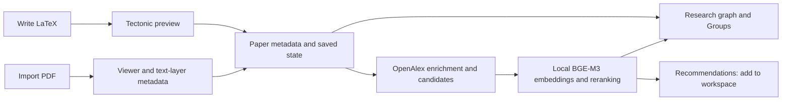
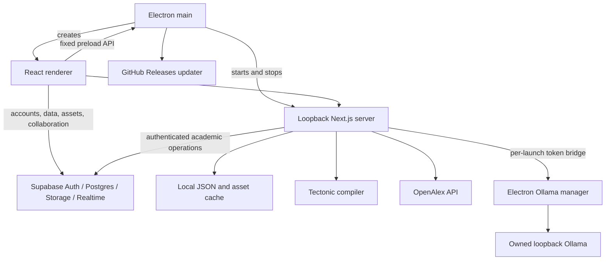

# PaperGraph

<div align="center">


**A Windows desktop workspace for writing, organizing, and exploring scientific literature.**

[Download releases](https://github.com/Hug00x/PaperGraph/releases) · [Report an issue](https://github.com/Hug00x/PaperGraph/issues)
</div>

## Overview

PaperGraph **0.1.9** combines LaTeX writing, PDF collection, a research graph, spatial Groups, academic discovery, and shared workspaces. OpenAlex supplies metadata and discovery candidates; local BGE-M3 inference helps connect and rank papers. The packaged target is Windows x64; Next.js development mode is also available.

## Features

### Writing and LaTeX

- CodeMirror syntax highlighting, draft autosave, review/published states, saved version history, and restoration.
- Local Tectonic compilation and PDF preview; article image/PDF assets with insertion helpers.
- Yjs-based collaborative LaTeX and remote cursors over Supabase Realtime.

### PDFs

- Single or multiple PDF import with sequential processing, duplicate detection, per-file status, retryable failures, and a 50 MiB file limit.
- Text-layer metadata extraction: title from first-page layout; DOI and abstract from up to the first three pages. There is no OCR or conversion to editable LaTeX.
- PDF.js viewer with zoom, selectable text, and persistent yellow, green, blue, pink, or purple highlights. Expand entries, navigate to pages, recolor, or delete highlights.
- Workspace members read highlights; editors create, recolor, and delete them. Cloud highlights are separate database records; local-workspace highlights use browser storage. They do not modify PDF bytes.
- Imported PDFs use a SHA-256 content identity; compiled previews use source and asset identities. Replacing a document does not inherit old highlights. Highlight comments and PDF annotation export are absent.

### Research graph

- Papers as nodes with persisted positions, selection, pan/zoom, search, and unlinked-mention detection.
- Manual, Wikilink (`[[Paper]]` or `[[Paper|visible text]]`), Citation, and Semantic relationships with remembered type filters.
- Multiple types can connect a pair. Edges form a compact bundle by default, fan out when either paper is selected, and collapse on deselection. Stable type ordering and recalculated geometry support dragging and zoom.
- Types and relationship notes appear in the selected paper's inspection list. Current graph paths have no inline relationship labels or directional citation arrowheads.

### Visual organization: Groups

- Draw named colored Groups; select, rename, recolor, resize, delete, and save plain-text notes.
- Membership follows a paper's center position. Drag papers into/out of Groups; moving a Group moves the papers currently inside it. Resizing changes membership without moving papers.
- Groups overlap; papers in multiple Groups blend their colors. Deletion preserves papers and relationships.
- Geometry, notes, and positions persist through revision-checked snapshots. Editors modify them; viewers browse. Collaborators receive live previews and committed changes.

See [Limitations](#limitations) for the current overlapping-Group pointer issue.

### Workspaces, accounts, and settings

- Supabase email/password authentication, sessions, sign-out, and account deletion through a deployed Edge Function.
- Workspaces, invitations, viewer/editor roles, ownership transfer, member management, and workspace deletion.
- Profile photos in Account settings and member lists, with initials fallback. JPG/PNG/WebP inputs up to 5 MiB are center-cropped and re-encoded to 256 × 256 WebP.
- Private avatar bucket with owner/workspace-peer reads through signed URLs; owner uploads/removal. Updated account-deletion deployment includes avatar cleanup.
- Atomic cloud snapshots, revision checks, and three-way merge for independent edits; conflicts preserve local recovery state.
- Workspace presence, graph drag previews, save notifications, reconnect catch-up, and collaborative editor state.
- English/Portuguese, dark/light themes, built-in help, and remembered workspace/tab/article selection.

### Desktop updates

Packaged builds check GitHub Releases once, about 4.5 seconds after startup. Download requires confirmation. Real `electron-updater` download events drive a **Windows taskbar progress bar**, without an in-app numeric percentage or byte counter. Completion offers restart/install now or later; downloaded updates are configured to install on quit. Errors clear progress and show a dialog. No periodic scheduler or manual check button is implemented.

## How It Works


```mermaid
flowchart LR
  Write[Write LaTeX] --> Preview[Tectonic preview]
  Import[Import PDF] --> PDF[Viewer and text-layer metadata]
  Preview --> Paper[Paper metadata and saved state]
  PDF --> Paper
  Paper --> Graph[Research graph and Groups]
  Paper --> OA[OpenAlex enrichment and candidates]
  OA --> AI[Local BGE-M3 embeddings and reranking]
  AI --> Graph
  AI --> Recommendations[Recommendations: add to workspace]
```

Imported PDFs remain documents to read. Recommendation reranking can fall back to OpenAlex ordering when local inference is unavailable.

## Architecture

Electron starts a loopback Next.js server, loads it in a sandboxed window, and owns a separate managed Ollama process. Packaged builds use standalone output; desktop development starts Next.js development mode.


```mermaid
flowchart TB
  Main[Electron main] -->|starts and stops| Server[Loopback Next.js server]
  Main -->|creates| Renderer[React renderer]
  Renderer -->|fixed preload API| Main
  Renderer --> Server
  Renderer -->|accounts, data, assets, collaboration| Cloud[Supabase Auth / Postgres / Storage / Realtime]
  Server -->|authenticated academic operations| Cloud
  Server --> Files[Local JSON and asset cache]
  Server --> Tectonic[Tectonic compiler]
  Server --> OpenAlex[OpenAlex API]
  Server -->|per-launch token bridge| Manager[Electron Ollama manager]
  Manager --> Ollama[Owned loopback Ollama]
  Main --> Updates[GitHub Releases updater]
```

Node integration is disabled; context isolation and sandboxing are enabled. Preload exposes only semantic-runtime state, retry, and subscription methods. The local workspace, asset, and compilation HTTP routes do not have a complete authentication boundary: do not expose them as a public web service. See [SECURITY_AUDIT.md](SECURITY_AUDIT.md) and [RELEASE_READINESS.md](RELEASE_READINESS.md).

## Local Semantic Processing

The desktop includes **Ollama 0.34.3**, pinned to the official Windows amd64 archive and SHA-256 in `electron/embedding-runtime-config.json`. Preparation verifies the archive/executable manifest, rejects traversal entries, and preserves upstream notices. Model weights are not bundled.

At window startup, the manager starts Ollama, checks for **`bge-m3`**, downloads it if missing, and validates a real non-zero **1,024-dimensional** vector. Preparation begins at startup, rather than waiting for the first recommendation. The status UI reports model download/preparation and offers retry after failure.

Ollama prefers `127.0.0.1:11435`, selecting another port if occupied. Models are stored in `%LOCALAPPDATA%\PaperGraph\ollama\models`, beside an isolated home and runtime logs. PaperGraph ignores Ollama on `PATH`, leaves the user's normal `.ollama` directory alone, sets `OLLAMA_NO_CLOUD=1`, and verifies the owned listener. A Windows guardian and app shutdown handling stop owned processes. Errors require retry; automatic crash restart is not promised. Models remain outside the install directory and uninstall is configured to preserve app data.

The input is exactly `title + "\n\n" + abstract`. Supabase stores `vector(1024)` embeddings in `articles.embedding`, with model/input-hash metadata. A trigger invalidates vectors after title/abstract changes. Matching hashes and bounded in-memory caches avoid repeated work. Semantic graph discovery requests up to **three** neighbors per paper and requires raw cosine similarity of at least **0.50** by default; this is a score cutoff, not a probability.

## Research Discovery

OpenAlex provides DOI/ID lookup, authors, abstract, year, topics, references, citation counts, publication/PDF URLs, and `search.semantic` discovery. Recommendations request up to **30** candidates, remove seed/workspace duplicates, rerank locally in batches of four when possible, and display up to **10**. Adding a recommendation saves scientific metadata as a published article and creates a graph position. Available publication PDFs can be opened in the viewer.

The client serializes requests with 350 ms ordinary and 1,000 ms semantic spacing, a 15-second timeout, and two attempts for 429/5xx responses. `OPENALEX_API_KEY` is supported. Local reranking failure retains provider order; OpenAlex failure is reported rather than replaced with another provider. Live provider access is a separate validation requirement.

## External Services and Data

| Service | Why / when |
| --- | --- |
| Supabase Auth | Registration, confirmation, sign-in, refresh, sign-out |
| Supabase Postgres | Shared articles, workspaces, graph, Groups, highlights, embeddings |
| Supabase Storage | Workspace PDFs/images and private avatars |
| Supabase Realtime | Presence, graph previews/notifications, collaborative editing |
| Supabase account-deletion Edge Function | Authorized account/storage cleanup |
| OpenAlex | Metadata and discovery queries containing title/abstract text |
| Publication PDF hosts | Server-side retrieval of available discovered PDFs when opened in the viewer |
| Local Ollama / model distribution | Local inference and missing-model download |
| GitHub Releases | Startup update checks and confirmed downloads; build-time runtime retrieval |
| Tectonic resource distribution | Uncached compiler resources may require network access |

Inference is local, but shared-workspace metadata and vectors are stored in Supabase and discovery queries go to OpenAlex. Accounts, cloud data, initial model download, updates, and uncached compiler resources need network access. PaperGraph is not fully offline and has no OpenAI embedding integration.

## Installation

1. Download `PaperGraph-Setup-0.1.9.exe` from the releases page.
2. Run the Windows x64 NSIS installer and choose an install directory if needed.
3. Launch from the desktop or Start Menu; initial account/model setup requires internet access.

NSIS defaults to per-user installation, with editable path, desktop/Start Menu shortcuts, and `papergraph://` registration. Deep links currently focus the window. Tectonic and Ollama binaries are bundled; BGE-M3 is downloaded separately. The reviewed installer/app are unsigned. Build success does not establish installed upgrade behavior; consult release readiness.

## Development

Use Node.js with npm and `--experimental-strip-types` support (review environment: Node 22.21.0). Windows x64 is required for the bundled compiler/runtime workflow.

```bash
npm ci
npm run dev
# Or launch the desktop shell and its local server:
npm run desktop:dev
```

Create an ignored `.env.local` using the table below; no `.env.example` is included. For cloud features, apply `supabase/bootstrap-workspace.sql` then all migrations in filename order to your own project. Redeploy `supabase/functions/delete-account` for avatar cleanup. The documentation review did not deploy migrations or change production data. Web-only development uses its own configured Ollama endpoint.

## Building and Testing

| Command | Purpose |
| --- | --- |
| `npm run dev` / `npm run start` | Development / built Next.js server |
| `npm run build` | Standalone production build |
| `npm run desktop:dev` | Prepare runtime and launch desktop development |
| `npm run desktop:clean` | Delete generated desktop output |
| `npm run runtime:prepare` | Prepare pinned runtime without model weights |
| `npm run desktop:prepare` | Runtime, standalone resources, public configuration, compiler, icons |
| `npm run desktop:dir` | Clean/build/prepare an unpacked desktop bundle |
| `npm run desktop:build` | Clean/build/prepare Windows NSIS installer |
| `npm run desktop:publish` | Build/publish via configured GitHub provider; authorized releases only |
| `npm run lint` | ESLint |
| `npm run embeddings:backfill` | Administrative embedding backfill; writes configured database data |

Current suites: `test:semantic`, `test:recommendations`, `test:persistence`, `test:zones`, `test:graph-live`, `test:pdf-import`, `test:pdf-highlights`, `test:profile-avatars`, and `test:runtime`. Multi-relation layout has a test file without a dedicated npm script. Run all Node suites with:

```bash
node --experimental-strip-types --test tests/*.test.mjs tests/*.test.cjs
npm run lint
npm run build
npm audit
node scripts/verify-desktop-bundle.cjs
```

Browser scripts: `test:zones:browser`, `test:graph-live:browser`, `test:pdf-highlights:browser`, and `test:profile-avatars:browser`. They temporarily create fixture routes and use isolated profiles/mock services. Run against a development server with Chrome/Edge installed. `GRAPH_TEST_URL` is the base URL (default port 3000); `PDF_TEST_URL` and `PROFILE_PHOTO_TEST_URL` are full fixture URLs (default ports 3011/3012). `BROWSER_PATH` overrides discovery. Fixture success does not validate deployed Supabase or an installed upgrade.

On Windows, use `npm.cmd` if execution policy blocks `npm.ps1`. Additional packaged-runtime, installer, and live-service scripts have prerequisites: inspect them before running against any installation/database.

## Project Structure

| Path | Contents |
| --- | --- |
| `electron/` | Main/preload, Ollama manager/guardian, runtime pin |
| `src/app/`, `src/components/` | Next.js routes and React UI |
| `src/lib/` | Persistence, merge, collaboration, academic/asset logic |
| `supabase/` | Bootstrap, ordered migrations, account function |
| `scripts/`, `tests/` | Packaging/validation, Node suites, browser fixtures |
| `public/`, `src/imagens/` | Assets and logos |
| `build/`, `desktop-dist/` | Generated runtime/resources and installers |

Internal filenames, SQL columns, and test commands retain `zone`; the current UI calls the feature **Groups**. `docs/zones.md` describes an earlier implementation and is not authoritative for current overlap or Realtime behavior.

## Configuration

| Variable | Purpose |
| --- | --- |
| `NEXT_PUBLIC_SUPABASE_URL`, `NEXT_PUBLIC_SUPABASE_PUBLISHABLE_KEY` | Public cloud configuration |
| `NEXT_PUBLIC_AUTH_CONFIRMATION_URL` | Optional confirmation redirect |
| `SUPABASE_SERVICE_ROLE_KEY` / `SUPABASE_SECRET_KEY` | Server/admin only; never distribute private keys |
| `SUPABASE_DELETE_ACCOUNT_FUNCTION_URL` | Optional deletion endpoint override |
| `SUPABASE_ACCESS_TOKEN` | Backfill authenticated access |
| `OLLAMA_BASE_URL` | Web inference endpoint; desktop supplies its bridge |
| `OLLAMA_EMBEDDING_MODEL` | Web model, default `bge-m3`; desktop manager fixes its model |
| `SEMANTIC_SIMILARITY_THRESHOLD` | 0..1 cosine threshold; default 0.50 |
| `OPENALEX_API_KEY` | Optional provider credential |
| `PAPERGRAPH_DATA_DIR`, `PAPERGRAPH_TECTONIC_PATH` | Local data/compiler overrides |

`PAPERGRAPH_MANAGED_EMBEDDINGS` and `PAPERGRAPH_EMBEDDING_TOKEN` are internal per-launch values. Packaging removes developer environment files and emits allowlisted public settings; Electron strips private Supabase/OpenAI key variables from the child environment.

## Limitations

- Windows x64 packaging; no macOS/Linux installer workflow.
- Overlapping Groups can obstruct another Group's header. Current browser acceptance reproduces a pointer failure; later dense-graph checks were not reached.
- No graph-path relationship labels/citation arrowheads, OCR, PDF-to-LaTeX conversion, highlight comments, or annotation export.
- Deployed cloud schema and account-deletion function are required; network failures can leave partial metadata with warnings/retry.
- Unsigned distribution and a real upgrade/update remain release concerns; see readiness.
- Local HTTP routes need an authentication boundary before public web deployment.
- Discovered-PDF retrieval lacks private-address/redirect restrictions and a download-size cap; the current audit documents this external-data risk.

## Contributing and License

Read the implementation and run relevant checks before proposing changes. No root `LICENSE` exists, so a project license is not declared here. Bundled runtime notices do not license the PaperGraph source itself.
