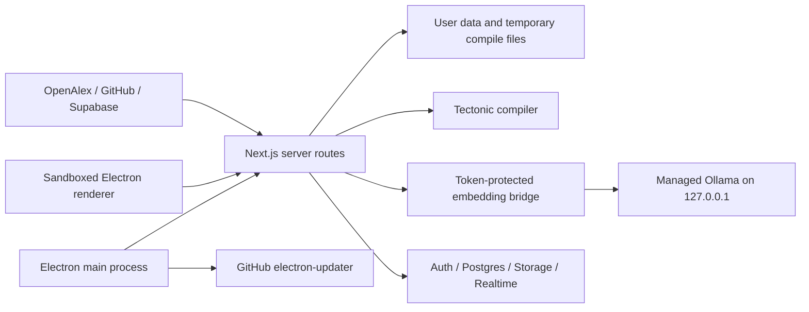

# PaperGraph Security Audit

Date: 2026-09-25
Scope: repository source, Electron shell, Next.js routes, Supabase SQL/functions, Ollama runtime integration, packaging scripts, generated bundle checks, dependencies and release configuration.

## Executive Summary

The audit found no confirmed remote code execution, no Electron arbitrary IPC bridge, no LaTeX `-shell-escape` flag, no bundled service-role key, and no dependency advisories reported by `npm audit`.

| Severity | Count | Status |
|---|---:|---|
| Critical | 0 | No confirmed finding |
| High | 3 | Two conditional release blockers and one credential-handling blocker |
| Medium | 5 | Hardening and exposure risks |
| Low | 2 | Defence in depth |
| Info | 4 | Confirmed controls and operational gaps |

The packaged desktop design is substantially hardened: Electron is sandboxed, the local server and Ollama bind to loopback, Ollama ownership is tracked, runtime downloads are checksum-pinned, and Supabase workspace isolation is enforced by RLS and RPC authorization. It is not ready to be called secure for arbitrary public web deployment or fully trusted public distribution until the High findings below are addressed.

## Release Blockers

- **[HIGH-001] Local Next.js routes have no application authentication.** The packaged server is loopback-only, but `npm run dev`, `next start`, a reverse proxy, or a changed bind can expose workspace, upload and LaTeX compilation operations.
- **[HIGH-002] No signing/release workflow is configured.** `electron-builder` publishes GitHub updates, but this repository has no visible GitHub Actions workflow and no Windows code-signing configuration. A compromised release account or unsigned artifact can become code execution on every installed client.
- **[HIGH-003] A private Supabase credential exists in `.env.local`.** It is ignored and was not bundled, but any real service-role/secret credential in a developer workspace must be rotated if exposure cannot be ruled out.

## Scope and Threat Model

### Assets

- Local LaTeX source, PDFs, notes, workspace metadata and embeddings.
- Supabase accounts, workspace data, collaboration state and Storage objects.
- Electron main-process capabilities, Tectonic, Ollama and model files.
- Release artifacts, update metadata and signing credentials.

### Trust boundaries

Inputs treated as untrusted include renderer requests, bearer tokens, workspace and article metadata, imported PDF/image files, LaTeX source, Storage paths, OpenAlex responses, deep-link arguments and downloaded archives/models.

## Findings Summary

| ID | Severity | Finding | Status |
|---|---|---|---|
| HIGH-001 | High | Local API routes lack auth when deployed beyond packaged loopback | Open; deployment blocker |
| HIGH-002 | High | Unsigned/incompletely governed updater and release path | Open; release blocker |
| HIGH-003 | High | Private Supabase credential present in local environment | Open; rotate if real |
| MEDIUM-001 | Medium | LaTeX compiler isolation is not explicitly proven by an OS sandbox | Open |
| MEDIUM-002 | Medium | Compile endpoint has no concurrency or PDF output quota | Open |
| MEDIUM-003 | Medium | No CSP was found for the Electron-loaded web app | Open hardening |
| MEDIUM-004 | Medium | Asset upload originally trusted declared MIME/extension | Fixed |
| MEDIUM-005 | Medium | External URL opening accepted arbitrary protocols | Fixed |
| LOW-001 | Low | Local file deletion is protected by generated safe names but has no symlink-specific test | Open |
| LOW-002 | Low | Dependency test runner emits module-type warnings | Open maintenance |

## HIGH-001: Unauthenticated Local API Routes

- **Files:** `src/app/api/workspace/route.ts`, `src/app/api/images/route.ts`, `src/app/api/images/[filename]/route.ts`, `src/app/api/compile/route.ts`.
- **Description:** These routes do not require a Supabase session. The packaged Electron server binds to `127.0.0.1`, which limits network exposure, but loopback is not authentication. A web deployment or accidental network bind would expose workspace read/write, file upload/read/delete and Tectonic compilation.
- **Impact:** Unauthorized local data access/modification and CPU/disk denial of service; potentially serious if the server is deployed publicly.
- **Likelihood:** Medium in development/misconfiguration; low in the current packaged default.
- **Recommendation:** Make deployment mode explicit. For desktop, inject a per-launch random local bearer token/cookie and require it on all local routes. For web deployment, require a validated Supabase session and workspace authorization for every route. Do not rely on Origin or loopback alone.
- **Correction applied:** Unauthenticated requests can no longer use the private Supabase fallback to download Storage objects. Full route authentication remains open because it needs a client/server contract change.

## HIGH-002: Updater and Release Trust

- **Files:** `package.json` build/publish configuration; no `.github/workflows/` directory was found.
- **Description:** GitHub publishing and `electron-updater` are configured, but no code-signing certificate/provider, signed release workflow, protected-tag policy, checksum publication policy or release permissions were found.
- **Impact:** A compromised GitHub release path or unsigned installer/update can achieve application compromise.
- **Likelihood:** Depends on repository account and release operations; high impact.
- **Recommendation:** Configure Windows Authenticode signing in a protected CI environment, use least-privilege release tokens/OIDC, protect tags and releases, pin CI actions by SHA, publish checksums, and test an update from a prior signed version. Do not enable broad `GITHUB_TOKEN` write permissions.

## HIGH-003: Private Credential in Local Environment

- **Files:** `.env.local` (not reproduced here and ignored by `.gitignore`); `scripts/backfill-embeddings.mjs` and test scripts consume private keys.
- **Description:** A private Supabase credential variable is present in the local environment. The current desktop packaging strips private Supabase and API keys from the Electron-launched server environment, and `scripts/verify-desktop-bundle.cjs` scans artifacts for them.
- **Impact:** Credential compromise if the value enters source control, logs, backups, build artifacts or shared diagnostics.
- **Recommendation:** Rotate the credential if it has ever been shared or committed; keep it only in a secret manager/controlled CI environment; add a repository secret scan and verify history, not only the current tree. Never place it in a distributed desktop build.

## MEDIUM-001: LaTeX Isolation

- **Files:** `src/app/api/compile/route.ts`.
- **Confirmed controls:** `execFile` is used without a shell, the executable path is not request-controlled, `-shell-escape`/`write18` was not found, compilation runs in a temporary directory and has a 45-second timeout, and source/assets are bounded or sanitized.
- **Remaining risk:** Tectonic filesystem and network behavior is not explicitly sandboxed at the OS level or covered by a canary test for `\\input`, `\\includegraphics`, writes, symlinks and external resources.
- **Recommendation:** Run compilation under a restricted account/container/job with a deny-by-default filesystem/network policy where practical. Add non-destructive confinement tests and enforce a maximum PDF/output size.

## MEDIUM-002: Compile Resource Exhaustion

- **File:** `src/app/api/compile/route.ts`.
- **Description:** A 45-second per-process timeout exists, but there is no explicit concurrent compile limit or output-size quota. Multiple requests and pathological documents can consume CPU, memory and disk.
- **Recommendation:** Add authenticated per-user rate limiting, a small compile queue/concurrency cap, request body limits at the server/proxy, and a maximum generated PDF size with cleanup.

## MEDIUM-003: Content Security Policy

- **Description:** No `Content-Security-Policy` header/meta policy was found. Electron has `contextIsolation`, `sandbox` and `nodeIntegration: false`, but CSP is useful defence in depth against renderer XSS.
- **Recommendation:** Add a production CSP compatible with Next.js assets, avoiding `unsafe-eval`, `unsafe-inline` and wildcard sources where possible. Validate it against the packaged app before enforcing it.

## MEDIUM-004: Upload Content Validation (Fixed)

- **File:** `src/app/api/images/route.ts`.
- **Description:** Upload selection previously relied on browser MIME type and extension. This was not direct code execution, but malformed content could reach PDF/image parsers.
- **Correction applied:** PNG, JPEG, WEBP and PDF uploads now require matching magic bytes, retain the 50 MB limit and use generated safe storage names.

## MEDIUM-005: External URL Protocol Validation (Fixed)

- **File:** `electron/main.cjs`.
- **Description:** External navigation/window-open handling forwarded non-local URLs to the OS shell without a protocol allowlist.
- **Correction applied:** `shell.openExternal` is now called only for `http:` and `https:` URLs. `file:`, `javascript:`, `data:`, custom and executable-associated protocols are rejected.

## Electron Security

- `nodeIntegration: false`, `contextIsolation: true`, `sandbox: true` confirmed in `electron/main.cjs`.
- Preload exposes only fixed semantic runtime methods; no generic `ipcRenderer`, filesystem, shell, `exec` or `require` bridge is exposed.
- IPC handlers validate sender, main frame and trusted origin.
- No `webviewTag`, `enableRemoteModule`, `allowRunningInsecureContent`, unsafe certificate handler or production DevTools enablement was found.
- Navigation is restricted to the trusted local origin; external links are denied as window creation and now protocol-filtered before opening.
- Deep-link and second-instance handling only focuses the window; arguments are not converted into paths or commands.
- No remote web content is intentionally mixed with privileged preload APIs.

## IPC and Process Execution

- Only two `ipcMain.handle` channels were found: `semantic-runtime:state` and `semantic-runtime:retry`.
- `execFile`/`spawn` uses fixed executable paths or fixed argument arrays. No renderer-controlled command execution path was found.
- `taskkill` is called with the tracked child PID, not a process image name.
- The Ollama guardian uses a Windows Job Object and receives an owner PID; it does not kill arbitrary `ollama.exe` processes.

## File, PDF and LaTeX Security

- Uploaded asset names are reduced to generated safe names; compile image paths reject traversal and are resolved back inside the temporary compile directory.
- Storage paths are syntax-checked and unauthenticated Storage downloads are now rejected instead of falling back to the private service client.
- PDF import tests pass and reject invalid files before extraction/upload.
- No archive extraction of user-supplied ZIPs was found. The build-time Ollama archive checks absolute and `..` entries before extraction.
- PDF content is rendered/extracted as data; no embedded PDF JavaScript execution was found.
- Remaining work: parser-level file signature/size limits for every import path and explicit OS isolation/output quotas for Tectonic.

## Local AI / Ollama Security

- Runtime version and archive SHA-256 are pinned in `electron/embedding-runtime-config.json`.
- Download uses HTTPS GitHub release URLs, verifies the archive before extraction, validates archive entries and records an executable hash.
- Ollama binds to `127.0.0.1`, uses a private model directory, disables cloud behavior, and is accessed by a token-protected local bridge.
- The model ID is configuration-controlled and no user model name is interpolated into a shell command.
- Ownership is verified using the runtime PID and listener check; shutdown targets the tracked process tree.
- Runtime lifecycle tests pass.

## Supabase / Authentication / RLS

- Authenticated academic and recommendation routes validate bearer sessions using `auth.getUser()`.
- Workspace tables enable RLS. Policies and RPCs scope reads/writes by membership/editor/owner roles.
- Atomic snapshot RPCs derive authorization from `auth.uid()`, override client workspace ownership fields, and tests cover viewer, outsider and anonymous write denial.
- Similarity search is `security invoker`, bounded to 1..100, and revoked from `anon`.
- Storage policies scope objects to user/workspace membership and editor roles.
- No service-role key is present in the packaged desktop environment according to the bundle verifier.
- Remaining issue: local workspace/image/compile routes are not Supabase-authenticated, so deployment mode must be enforced separately.

## Installer / Update Security

- NSIS is per-user (`perMachine: false`), does not request admin solely for installation, and does not delete app data on uninstall.
- `papergraph://` is registered, but deep-link parameters are not used for privileged actions.
- `electron-updater` is configured for GitHub and asks for user confirmation before download/install.
- No signing configuration, signed update acceptance test or release workflow was found. This remains a distribution blocker, not a proof that the current local code is exploitable.

## Supply Chain / CI

- `npm audit` reported 0 info/low/moderate/high/critical vulnerabilities across 715 dependency entries.
- `package-lock.json` exists and should be used with `npm ci` in controlled CI.
- No `.github/workflows/` files were found, so action pinning, workflow permissions, PR secret exposure and release automation could not be verified.
- Build-time runtime download is pinned and checksummed. Model weights are downloaded by Ollama at first use and are not included in the installer; provenance and disk quota should be documented for production release.
- `*.pem`, `.env*`, logs, local data and generated build outputs are ignored. Current ignore rules do not ignore generic `*.key`, `*.p12` or model caches; review this before public repository use.

## Fixes Applied

- Added an HTTP(S)-only allowlist before Electron invokes `shell.openExternal`.
- Added LaTeX source size limit (2 MiB) and bounded request asset metadata.
- Strengthened compile path confinement using resolved paths and relative-scope checks.
- Prevented unauthenticated Storage reads from falling back to a private Supabase service client.
- Added magic-byte validation for PNG, JPEG, WEBP and PDF uploads.
- Existing controls verified: sandboxed Electron, fixed preload API, loopback Ollama, token bridge, process ownership, archive checksum/traversal checks and Supabase RLS/RPC tests.

## Validation Results

- `npm audit`: PASS, 0 vulnerabilities.
- `npm run lint`: PASS.
- `npm run test:pdf-import`: PASS, 3 tests.
- `npm run test:recommendations`: PASS, 20 tests.
- `npm run test:persistence`: PASS, 9 tests.
- `npm run test:runtime`: PASS, 6 tests.
- `npm run build`: PASS, production Next.js build.
- Focused ESLint for changed API routes: PASS.
- `node --check electron/main.cjs`: PASS.
- `node scripts/verify-desktop-bundle.cjs`: NOT RUNNABLE in this workspace because `desktop-dist/win-unpacked/resources/ollama/papergraph-runtime.json` is absent; no unpacked desktop bundle was available to inspect.
- Warnings: Node reports `MODULE_TYPELESS_PACKAGE_JSON` for test-loaded TypeScript modules; no test failure resulted.
- Desktop installer build and signed update flow were not run in this audit because they require a Windows packaging/release environment and signing credentials.

## Remaining Risks and False Positives

- The private key finding is not evidence that a key is committed or bundled; it is a rotation/handling risk because the local environment contains a private credential.
- Loopback binding meaningfully reduces remote exposure, but does not authenticate other local processes. It is not sufficient for a publicly reachable Next deployment.
- `innerHTML = ""` only clears a DOM node; no unsafe HTML assignment was found. React-rendered metadata remains escaped, and publication URLs have application-level validation.
- `spawn` and `execFile` findings are fixed-path process management, not command injection by themselves.
- Lack of signing is a release integrity gap, not a confirmed exploit in the source tree.

## Priority Plan

- **P0:** Rotate any real credential in `.env.local` if exposure is possible. Define and enforce a release signing/protection process before public auto-updates. Prevent non-desktop deployments from exposing unauthenticated local routes.
- **P1:** Add local per-launch authentication, compile rate/concurrency/output limits, and non-destructive LaTeX confinement tests.
- **P2:** Add CSP, generic secret scanning, archive/model disk quotas, magic-byte validation to every future import type, and symlink/reparse-point tests for destructive operations.
- **P3:** Add GitHub Actions with least-privilege permissions, SHA-pinned actions, Dependabot/CodeQL as appropriate, a signed update acceptance test, and remove module-type warnings.

## Recommended Next Steps Before the Next Release

1. Decide whether Next.js API routes are desktop-only or supported as a web deployment; implement the corresponding authentication boundary.
2. Rotate the local private Supabase credential if it is not guaranteed to be disposable and private.
3. Configure Authenticode signing and protected release automation before enabling public auto-update distribution.
4. Add focused tests for route authentication, local token enforcement, LaTeX read/write confinement, compile quotas and updater signature verification.
5. Re-run the bundle verifier, desktop packaging tests, and a signed upgrade from the previous released version.
