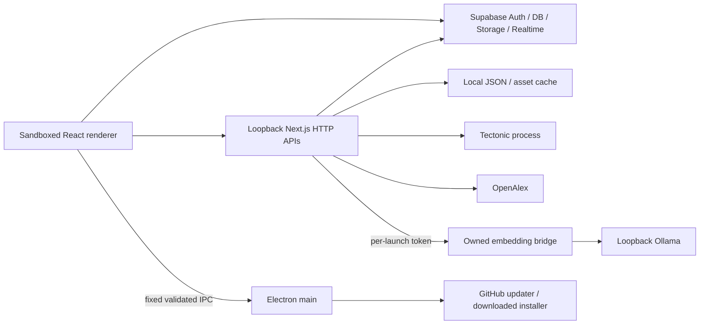

# PaperGraph Security Audit

- **Date:** 2026-10-02 (Europe/Lisbon)
- **Version:** 0.1.9
- **Source:** `b93ecad`, current working tree and freshly generated Windows x64 artifacts
- **Scope:** Electron/main/preload, Next.js routes, UI/graph/Groups, assets/PDFs/avatars, compiler/runtime processes, Supabase bootstrap/all migrations/account function, packaging/updater, dependencies and bounded current-tree secret checks.

## Anara addendum — 2026-10-03

**Deep Research extension:** selected bibliographic metadata and user questions cross a new explicit-user-action boundary to Anara MCP; a Group name or bounded previous answer can accompany them. PDFs, source/LaTeX, Group/workspace notes, highlights, embeddings and full graph are excluded by the strict contract. Fixed research IPC validates action/IDs/counts/lengths and retains main-frame/window/origin sender checks. Tokens remain in main; the additional research consent requests `anara:chat`, never `anara:write`. Responses/HTTP bodies are bounded; React renders escaped text and normalized HTTP(S) links. Discovered tools are allowlisted for start/status/result/cancel only. Canonical paper imports reuse authenticated OpenAlex preparation and existing workspace persistence; Viewer writes are blocked, Group notes require preview/append. No research state enters Realtime/DB. Fifteen new tests and isolated UI checks pass; one live research call was rejected as invalid/expired token, so live response/scope/cancellation behavior remains unverified. See [complete security boundaries and evidence](docs/deep-research.md). These are scoped regression checks, not a replacement for the historical full audit below.

An optional desktop MCP connection stores tokens with Electron safeStorage and exposes status/actions through validated main-frame IPC. Browser OAuth uses ephemeral loopback, state, PKCE and SDK issuer validation; requests are restricted to Anara HTTPS. Local deletion always precedes best-effort revocation, which Anara does not advertise for public clients. See [Anara boundaries and validation](docs/anara.md). The connection is device-scoped and independent of Supabase identities; future tool use needs an ownership policy. The historical audit below does not review this new implementation. Current npm audit reports 13 high findings in existing electron-builder/eslint dependency chains, none attributed to new MCP packages; the prior zero-advisory result is historical.

## Executive Summary

No Critical finding was identified in this review. Two High risks remain: an incomplete local HTTP authorization boundary and unsigned release/update distribution. They have different scopes: public API exposure is a deployment risk, while signing is a release-integrity gap. Neither is proof of a confirmed remote source-code exploit in the default packaged configuration.

Counts below include **current open findings only**. Fixed historical findings and informational concerns are excluded. Hardening gaps and untested boundaries are explicitly identified.

| Severity | Current open count |
| --- | ---: |
| Critical | 0 |
| High | 2 |
| Medium | 4 |
| Low | 2 |

Fresh npm audit reports zero advisories, 97 Node tests pass, and the fresh bundle verifier finds no configured private build-secret values. These checks do not establish that the whole application or its history is secure. Deployed cloud state, clean installation and actual upgrade/update are untested.

## Findings Summary

| ID | Severity | Finding | Status / evidence type |
| --- | --- | --- | --- |
| H1 | High | Local workspace/asset/compile APIs lack complete authorization | OPEN; source-confirmed boundary gap, mitigated by packaged loopback binding |
| H2 | High | Installer/app unsigned; release/update governance unverified | OPEN; current artifact signatures plus operational gap |
| M1 | Medium | Tectonic filesystem/network confinement unproven | OPEN; hardening / untested execution boundary |
| M2 | Medium | Compile endpoint lacks concurrency/output/disk quotas | OPEN; source-confirmed availability gap |
| M3 | Medium | No application production CSP found | OPEN; renderer hardening gap |
| M4 | Medium | Publication-PDF private-address requests and unbounded response buffering | OPEN; controlled current-route reproduction, authenticated workspace mocked |
| L1 | Low | Local asset filesystem operations lack symlink/reparse-point acceptance | OPEN; untested filesystem boundary |
| L2 | Low | Avatar decoding has no explicit decoded-pixel/dimension bound | OPEN; new resource-hardening gap, no exploit reproduced |

## Security / Release Blockers

H2 remains a distribution release gate. H1 blocks publicly reachable Next.js deployment; packaged loopback reduces exposure but does not authenticate local callers. Remaining release acceptance gates, including the reproducible Groups interaction failure, are listed in [RELEASE_READINESS.md](RELEASE_READINESS.md); that UI failure is not classified as a security vulnerability.

A `SUPABASE_SECRET_KEY` variable is present locally. Its value was not reproduced, rotated, or sent to a service. Presence in an ignored environment file is **not** evidence of compromise and no longer counts as a High vulnerability or unconditional release blocker. If actual exposure is discovered, rotate it through the normal credential process.

## Threat Model

Assets include scientific source/PDFs, local cached files and sessions, shared workspaces/notes/highlights/avatars, stored vectors, runtime/model files, and installer/update trust. Untrusted inputs include HTTP requests, LaTeX, imported images/PDFs, Group geometry/notes, graph broadcasts, OpenAlex metadata/URLs, deep links, and downloaded artifacts.

```mermaid
flowchart LR
  Renderer[Sandboxed React renderer] --> HTTP[Loopback Next.js HTTP APIs]
  Renderer -->|fixed validated IPC| Main[Electron main]
  Renderer --> Cloud[Supabase Auth / DB / Storage / Realtime]
  HTTP --> Cloud
  HTTP --> Files[Local JSON / asset cache]
  HTTP --> Compiler[Tectonic process]
  HTTP --> OA[OpenAlex]
  HTTP -->|per-launch token| Bridge[Owned embedding bridge]
  Bridge --> Ollama[Loopback Ollama]
  Main --> Updates[GitHub updater / downloaded installer]
```

Authenticated Supabase access and token-protected inference do not protect unauthenticated local HTTP operations or arbitrary local programs from each other.

## High Findings

### H1 — Local HTTP and cached-asset authorization

`src/app/api/workspace/route.ts` exposes local GET/PUT without a validated session/token. `src/app/api/images/route.ts` permits local uploads; `images/[filename]/route.ts` reads/deletes accepted local filenames without caller authorization. `compile/route.ts` extracts an optional bearer for cloud asset downloads but does not require authentication to compile. No per-launch application token protects these routes.

Electron binds its Next.js child to 127.0.0.1 with preferred port 34173/fallback. That limits remote reachability; direct development/production Next.js commands or a proxy must not expose these endpoints publicly. Local malicious callers and renderer compromise remain relevant. Cached assets are served before Storage authorization and use public immutable cache headers; the cache is shared across sessions in this installation. Supabase RLS does not authorize subsequent local-cache reads. Compilation also copies the full local asset directory before selecting article assets.

Impact: local data read/change/delete and resource exhaustion; substantially worse on accidental network exposure. No cross-site exploit or cloud RLS bypass was demonstrated. Require desktop per-launch authentication and explicit mode constraints, or validated cloud session/workspace authorization for supported web deployment. Scope/cache assets per user/workspace and review logout/cache handling.

### H2 — Unsigned release and update trust

Fresh `desktop-dist/PaperGraph-Setup-0.1.9.exe` and `win-unpacked/PaperGraph.exe` return **NotSigned** from Get-AuthenticodeSignature. There is no visible signing credential/provider configuration or `.github/workflows` directory. Remote account security, tag/branch protection, release permissions and CI settings were not inspected, so their absence is not asserted.

GitHub publishing and electron-updater are configured. Fresh latest.yml SHA-512/size matches the installer and a blockmap exists; hashes detect inconsistency but metadata from a compromised publisher is not independent identity verification. Signtool-related build logs did not yield signed binaries.

Impact: distribution/release-account compromise can deliver executable code. This is an operational supply-chain risk, not a demonstrated remote application exploit. Establish protected signed release operations, least-privilege credentials and a staged signature/update acceptance test before public distribution. Actual release-to-release install/data preservation is NOT TESTED.

## Medium Findings

### M1 — Compiler confinement

`src/app/api/compile/route.ts` uses a fixed/configuration-controlled Tectonic path with execFile and fixed argument arrays, not shell interpolation. Source is limited to 2 MiB; requested asset metadata is sliced to 200 entries. Compilation uses a temporary directory, a 45-second process timeout and finally cleanup. Image-reference paths reject traversal and are resolved inside that directory. No shell-escape/write18 enabling flag is passed.

A temporary working directory is not OS filesystem/network isolation. Arbitrary LaTeX input/read/write behavior, absolute paths, symlinks and uncached network resources were not exercised with confinement canaries. Tectonic runs with the current user's privileges. This is an unproven boundary, not a claim of confirmed arbitrary command execution. Add restricted execution and targeted read/write/network acceptance.

### M2 — Compile resource exhaustion

The endpoint has no explicit request concurrency/rate limit or generated-PDF/temporary-disk quota. maxBuffer bounds process logs, not output PDF bytes. Source and asset-count limits do not bound the full local asset directory copied for each request, downloaded asset totals, decoded files, or total concurrent processes. Request JSON/form parsing occurs before application size checks.

Impact is CPU/memory/disk exhaustion, particularly with H1 exposure. Add a bounded compile queue, aggregate asset/output quotas and request limits; validate cleanup on failure. No stress benchmark or denial-of-service exploit was run.

### M3 — CSP hardening

No production Content-Security-Policy header/meta or Electron response policy was found in next.config.ts, layout or Electron shell. Context isolation and sandboxing exist; CSP would further constrain renderer script execution. Add a compatible policy and validate packaged features without unnecessary unsafe-eval/wildcards. No renderer XSS was identified by this bounded source review.

### M4 — Publication-PDF request and response boundary

`src/app/api/recommendations/route.ts` action `publication-pdf` validates Auth and readable article scope, then obtains a PDF URL from OpenAlex or stored discovery metadata. URL validation permits HTTP(S) without rejecting loopback, private/link-local addresses or arbitrary ports. Fetch follows redirects automatically and buffers the entire response with arrayBuffer before checking its PDF prefix. The 15-second timeout is not a response-byte/memory quota.

A temporary harness executed the current transpiled route with mocked valid Auth/article lookup and OpenAlex not-found fallback. A crafted stored discovery marker pointed to a harmless owned 127.0.0.1 HTTP fixture. The actual HTTP request reached that fixture and its PDF body was returned with status 200. No production data/network endpoint was used. This confirms private-address retrieval through the route under those prerequisites; it is not a demonstrated unauthenticated remote exploit or proof of cloud data exfiltration.

A malicious shared-paper editor or external metadata/redirect source can cause a viewing user's server to make unintended local/private GET requests. Arbitrary non-PDF response bodies are not returned, but requests occur before format checking and oversized bodies can exhaust memory. Restrict resolved destinations and each redirect hop, handle DNS rebinding, and enforce a streaming byte cap before buffering/parsing. Add local fixture regressions for private addresses, redirects and oversized responses. Authentication alone does not validate an outbound destination.

## Low Findings

### L1 — Filesystem link/reparse-point boundary

Generated filenames and traversal rejection reduce unsafe path access. Local cached asset reads, copies and deletion do not have explicit symlink/reparse-point rejection or adversarial filesystem acceptance. This requires a local filesystem attacker and remains untested; safe filename syntax alone is not a filesystem confinement proof. Add targeted checks/tests where local files are read or deleted.

### L2 — Avatar decoded-size limits

`src/lib/profile-avatar.ts` limits declared JPEG/PNG/WebP inputs to 5 MiB and successfully decodes/re-encodes through createImageBitmap/canvas. Output is 256px WebP; Storage limits the private bucket to 512 KiB WebP. There is no explicit maximum source dimension/pixel count before browser decode, and no separate input magic-byte check in this path. High-dimension compressed images can require much more decoded memory than file size implies. This is a user-selected-image resource-hardening concern, not a demonstrated account compromise. Consider dimension bounds and targeted decoder tests.

## Electron / IPC / Privileged Operations

**STATICALLY VERIFIED** in electron/main.cjs/preload.cjs:

- nodeIntegration false, contextIsolation true, sandbox true; default webSecurity is not disabled.
- External OS opening allows only HTTP(S). Navigation leaves the app only through that allowlist; new windows are denied. Downloads through ordinary HTTP(S) window download events are prevented.
- Deep links/second-instance arguments only focus the app; no path/command execution is derived from them.
- Preload methods are `papergraphRuntime.getState`, `retry`, and `subscribe`; listeners subscribe only to `semantic-runtime:changed` and return unsubscribe.
- Main handles exactly `semantic-runtime:state` and `semantic-runtime:retry`, checking window webContents, main frame and trusted origin.
- No arbitrary channel/URL/filesystem/shell API is exposed. Update progress is handled inside main and does not widen preload.
- Server/runtime children use fixed executable paths/argument arrays; taskkill targets the tracked PID/tree. The guardian uses Windows process ownership/Job Object logic.
- Normal application startup does not enable a remote debugging port; smoke harnesses do so explicitly.

No updater renderer IPC, generic ipcRenderer bridge or request-controlled process command was found.

## Authentication / Supabase / RLS

The browser uses Supabase's public configuration/default session persistence. Academic/recommendation routes validate bearer sessions with auth.getUser and scope workspace access. Account deletion validates the user and uses either server-only administration or the deployed Edge Function; the desktop strips private keys. Logout calls Supabase signOut. Default browser-stored sessions remain sensitive to renderer compromise. Hosted confirmation, refresh/expiry, recovery flows and account deletion were not runtime-tested.

Bootstrap enables RLS on profiles, workspaces, members, invitations, articles, versions, collaboration states, relations, positions, assets and ignored mentions. Member/editor/owner helpers and administrative RPCs check auth.uid and workspace rights, with explicit search_path for SECURITY DEFINER functions. Snapshot migrations revoke direct snapshot mutation privileges and authorize revision-checked saves. Deletion administration is service-role scoped. All migrations were inspected; actual hosted application is NOT VERIFIED.

| New/extended object | Read | Write/delete | Controls and evidence |
| --- | --- | --- | --- |
| `workspaces.zones` (Groups/notes JSONB) | Workspace members | Editors through authorized snapshot RPC; owner workspace deletion | Existing workspace RLS; no separate Group table; finite/ranged geometry, color/name/notes validation; revision/rollback/permission PGlite tests |
| `realtime.messages` map policies | Workspace members, private workspace topic | Member presence; editor broadcasts | Migration topic/membership checks; Node SQL/mock browser coverage, hosted Realtime untested |
| `pdf_highlights` | Workspace members | Editor insert/delete, created_by=auth.uid; editor color-only update | RLS enabled; composite article/workspace FK/cascade, SHA-256 key format, text/rect/color constraints; SQL tests |
| `profiles.avatar_path` | Owner profile; authorized member-avatar RPC | Owner profile writes | Path constrained to owner UUID and UUID.webp; existing profile RLS; new RPC checks authentication/membership |
| `papergraph-avatars` Storage objects | Owner or workspace peers | Owner insert/delete; no avatar update policy | Private bucket, 512 KiB WebP restriction, owner paths; revoked PUBLIC RPC execution; PGlite tests cover viewer/outsider/anonymous denial |
| Article embedding columns / similarity RPC | Workspace RLS | Authorized academic updates | vector(1024), invalidation trigger, SECURITY INVOKER similarity, limit 1..100, anon execution revoked |

The avatar member/read helpers are SECURITY DEFINER with fixed public search_path, PUBLIC execution revoked and authenticated grants. Account deletion lists/removes avatar files in bounded batches before data/user deletion. Code exists; Edge Function deployment and live cleanup were not verified. Policies are permissive in combination: deployments must also be checked for older conflicting broad policies, not merely for these migration files.

## File / PDF / Avatar Security

Local asset upload accepts PNG/JPEG/WebP/PDF, enforces 50 MiB, checks matching magic bytes and generates safe UUID-suffixed names. Supabase workspace upload uses scoped paths and policies; clients that call Storage directly do not traverse the local magic-byte validator. Browser PDF queue validates file type/name, nonempty size and 50 MiB before import; PDF.js handles parsing. No OCR exists.

Viewer uses PDF.js canvas/text layers and escaped React strings. No PDF JavaScript execution path or generic unsafe HTML renderer was found; that is source evidence, not an exhaustive malicious-PDF test. Original PDF identity uses SHA-256; compiled preview identity uses source/assets. Highlight rectangles/text/page/color are bounded, and updates cannot rewrite unrelated columns. Browser/SQL tests verify replacement separation, read-only UI, permission rejection and failed-save behavior.

Avatars use browser decode, center crop and WebP re-encoding, randomized owner paths and signed URLs (one-hour lifetime); no SVG input is accepted. Signed URLs are temporary bearer capabilities and can remain usable until expiration after membership changes. Upload precedes profile update; failed profile save cleans new upload best-effort; old photo is removed only after success. Hosted cleanup/URL revocation behavior is not tested. L2 documents the remaining decoded-resource boundary.

## Groups / Graph / External Data

Group names/notes and relation metadata use React text/textarea rendering. Color keys are allowlisted; geometry must be finite and in bounds. Names are limited to 80 characters, notes to 20,000. Group deletion preserves articles. Snapshot SQL authorization—not UI buttons—protects durable changes. Preview broadcasts are validated for targets/coordinates and do not overwrite durable data or notes; durable refresh/revision reconciliation controls saves. Groups add no privileged filesystem/process capability.

Multiple relation types remain data, with stable layout ordering and type filters; the graph draws no citation arrowheads or inline labels. The overlap pointer failure is QA, not authorization bypass. Malformed/outsider/anonymous tests pass locally; hosted graph editing permissions remain untested.

OpenAlex is untrusted input. Discovery normalizes/bounds fields and HTTP(S) publication/PDF URLs, restricts provider API requests to api.openalex.org/works, and renders text through React escaping. HTTP(S) protocol validation does not restrict PDF destination addresses: M4 documents the separate publication-PDF fetch boundary. The local client throttles and retries bounded 429/5xx attempts. Recommendations cap 30 candidates/10 display, filter seed/duplicates, use a 90-second rerank deadline/batches of four and bounded caches. Title/abstract is sent to OpenAlex semantic discovery; local inference does not mean that text never leaves the device. Comprehensive redirect/size/parser adversarial coverage remains incomplete.

## Local AI / Model Download

Ollama **0.34.3** is pinned to `ollama-windows-amd64.zip`, SHA-256 `306ce9e81e3491d147f558e60d7a389499f244d10f71859c6e4e899241d1b4ae`. HTTPS archive source is the official GitHub release, entries reject absolute/traversal paths, and a manifest pins executable hash. Fresh bundle verification confirms runtime/notices/guardian. It does not independently re-audit every runtime library or upstream binary.

Runtime binds 127.0.0.1, prefers port 11435/falls back, uses private `%LOCALAPPDATA%\PaperGraph\ollama` data and `OLLAMA_NO_CLOUD=1`, and ignores external PATH/global Ollama. It verifies version/listener ownership, tracks children and uses guardian/shutdown cleanup. The application-owned embedding bridge checks a random per-launch bearer token, fixed POST /api/embed, 1 MiB body, 1..8 inputs and 32,000 characters per input. It always selects configured bge-m3 rather than a request-supplied model. The raw Ollama loopback service is not independently token-authenticated; other local processes remain within the local threat model.

BGE-M3 pulls through a fixed API request without shell interpolation. Model progress uses real streamed layer totals; missing model triggers startup pull and validation. Model tag is `bge-m3`/latest, not an immutable weight digest pinned by PaperGraph. Disk/model provenance quotas remain operational hardening work. Current packaged smoke verifies existing-model readiness only; empty-model download, interruption/coexistence/owner-crash were not exercised.

Embedding storage is Supabase pgvector(1024); title/abstract input hashes invalidate stale vectors. Graph cosine threshold defaults to 0.50 and three neighbors. Inference is local, but cloud vectors/metadata and OpenAlex requests are network data.

## Installer / Update Security

NSIS defaults to per-user Windows x64 with selectable path, shortcuts/protocol, and app-data retention. Installed lifecycle is NOT TESTED. The fresh unsigned installer is 1,533,743,856 bytes; latest.yml and 1,596,143-byte blockmap exist. Version and SHA-512 match.

Updater checks once after 4.5 seconds, requires download confirmation, maps real progress to taskbar, resets on error/completion, and offers restart/install or later with install-on-quit configured. Mocked current-code event tests pass. There is no renderer-controlled update feed or generic new IPC. Repeated prompts lack explicit deduplication; closing during download and signed real upgrade acceptance remain untested. No publication occurred.

## Supply Chain / CI / Secrets

Fresh npm audit: **0 Critical, 0 High, 0 Moderate, 0 Low**, 715 total dependency entries. Initial restricted-network audit failed; retry succeeded. Lockfile exists; clean npm ci was NOT TESTED. Current installed Electron is 43.7.7 and Next.js 16.3.6; manifest ranges are not exact runtime pins.

No .github/workflows exists, so repository workflow permissions/action pinning/PR secret use could not be audited. Remote protections, GitHub credentials and release ownership were not verified. There is no root project LICENSE; runtime notices do not resolve project licensing.

A bounded scan of Git-tracked current text files found no matches for sb_secret, GitHub token, private-key block or JWT patterns. git log for .env.local returned no entries; full Git history, untracked files, other credential patterns and external backups were **not exhaustively scanned**. No values were printed. Known local private-key values were absent from 1,286 scanned fresh bundle files; Ollama binary tree and unknown secrets are outside that verifier's text scan. Packaging emits allowlisted public environment configuration and main strips private Supabase/OpenAI variables.

.gitignore excludes .env*, *.pem, logs, build/desktop output, .next*, .utmp and local workspace/assets. Generic *.key/*.p12/*.pfx are not explicitly excluded; protect future signing material with dedicated secret controls. No automatic credential rotation was performed.

## Previous Findings Re-evaluated / Fixed Controls

| Previous item | Current disposition |
| --- | --- |
| Unauthenticated local APIs | OPEN H1; cloud-download fallback mitigation does not authenticate local cache/routes |
| Unsigned/incompletely governed updates | OPEN H2, fresh signatures checked; latest.yml/blockmap absence is obsolete |
| Private environment credential as High blocker | RECLASSIFIED informational: presence confirmed, leakage not demonstrated |
| Compiler confinement / resource limits / missing CSP | OPEN M1/M2/M3, current limits described accurately |
| MIME-only local upload | FIXED, STATICALLY VERIFIED matching PNG/JPEG/WebP/PDF signatures |
| Arbitrary external protocols | FIXED, STATICALLY VERIFIED HTTP(S)-only OS opening |
| Symlink-specific filesystem acceptance missing | OPEN L1, untested boundary |
| Module-type warning as security finding | OBSOLETE as a security vulnerability; remains maintenance warning |
| Bundle verifier unavailable | OBSOLETE; current fresh bundle verifier passes |
| Avatar decoded-pixel bound | NEW L2 hardening gap, no exploit reproduced |
| Publication-PDF outbound retrieval | NEW M4, controlled loopback retrieval reproduced; no response size cap |

This review changed documentation, not production code. It does not claim fixes were implemented during this pass.

## Validation Results

- PASS: fresh lint, production/TypeScript build, 97 Node tests, npm audit, fresh desktop packaging retry with publishing disabled, fresh bundle/runtime/metadata checks.
- PASS: isolated avatar/highlight/mock live-graph browser suites and current updater mocked-event test.
- FAIL: Groups browser overlap hit-test, reproduced twice; original packaged smoke second-launch status-card assertion.
- FAIL security boundary: controlled publication-PDF loopback retrieval through current route with mocked authenticated workspace/OpenAlex fallback (`.utmp/review-publication-pdf.mjs`).
- PASS: temporary adjusted existing-model packaged smoke retains readiness/HTTP/shutdown assertions; not clean first-run acceptance.
- FAIL: Authenticode, both current binaries NotSigned.
- NOT TESTED: clean dependency install; installed/uninstalled lifecycle; real signed update/upgrade/progress; empty-model setup; deployed Auth/SQL/Storage/Realtime/Edge cleanup; compiler confinement/stress; comprehensive malicious PDF/image corpus and Git-history scanning.

Tests using PGlite/mock services establish local contracts, not deployed Supabase correctness. Artifact signing and functional acceptance remain separate from dependency advisory counts.

The mock live-graph browser assertions passed with hydration mismatch/recovery messages in the development log; that run does not establish a clean console or a production hydration defect. Node also reports module-type warnings without test failures.

## Priority Plan / Recommended Next Steps

1. Close H1's local/public HTTP boundary and cache-session scope, and establish H2's signed/protected distribution process.
2. Restrict publication-PDF destinations/redirects and response bytes (M4), add compiler confinement/concurrency/output acceptance, and validate a staged installed update with data/model preservation.
3. Verify hosted migration policies, avatar cleanup and real collaboration under distinct accounts; resolve the functional Groups blocker separately.
4. Add production CSP, avatar decoded-size limits and filesystem-link tests; complete secret-history/provenance coverage and clean-first-run/network failure tests.

See [RELEASE_READINESS.md](RELEASE_READINESS.md) for the three current release gates. No tags, pushes, releases, production database writes or credential changes were made.
